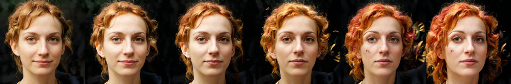

## How to Become More Salient? Surfacing Representation Biases of the Saliency Prediction Model

Predicted maximum saliency: 3.5501 → 4.7940 (135.04% increase)

This is a submission to the [Twitter Algorithmic bias
challenge](https://hackerone.com/twitter-algorithmic-bias).

### Summary
In this submission we present and apply a two-step mixed method for analyzing the bias of internal representations of the target saliency-prediction model. First, using a large-scale computer-vision model, we manipulate an image of a person in a way that increases maximum saliency predicted by the target model. This generates a dataset of images tweaked to make the target saliency-prediction model more excited. Second, we use qualitative thematic analysis of the obtained tweaked images to show that the target model is biased towards deeming more "salient" the depictions of people that appear slim, young, of light or warm skin color and smooth skin texture, and with stereotypically feminine facial traits.

#### Surfaced Harms
This submission surfaces internal biases of the core component of the target image-cropping algorithm (saliency prediction). These internal biases inherently translate into harms of under-representation when the algorithm is applied in the wild, cropping out those who do not meet the algorithm's preferences of body weight, age, skin color. This bias could result in exclusion of minoritized populations and perpetuation of stereotypical beauty standards in thousands of images.

### Method

#### Overview
The present analysis is inspired by notions of counterfactual fairness and counterfactual explanations. Both study the question of how the behavior of a target decision-making system changes if a system's subject has some of its attributes modified. E.g., would a given decision have been different if the subject had been of a different race? Would the decision have changed if the subject had had a different value of a certain attribute?

To surface internal representation biases, we start with an image of one person and retrieve the maximum saliency given by the target model on this image. We choose maximum saliency, as the research of Yee et al. demonstrates that this quantity is the most important in the outcomes of cropping. We then ask a question:

_What needs to change about this image for the maximum saliency to be higher that it currently is? Would the saliency have been higher if the person in the image had had slightly different traits?_

The modified images that increase the saliency — that we call "counterfactuals" — can provide a glimpse into how the model decides what is salient, thus showcasing the model's biases.

Note that both in the public discussions of biases of the Twitter image-cropping model, and in the analysis of Yee et al., the core method is stitching images of two or more people into one image, and observing which of the people the algorithm prefers to keep in view. The starting premise that makes our analysis feasible is the observation that the saliency predictions are variable not only when multiple people are present in one image, but also if the image has only one person in it [Yee et al. 2021, Section 3.3]. This means that surfacing representation biases of the target model does not necessarily require the presence of multiple people in one image.

#### Step 1: Generation of Counterfactual Faces
To generate and modify the test faces that we use for querying the model, we use StyleGAN2-ADA [Karras et al., 2020], pretrained on the Flickr-Faces-HQ dataset [Karras et al., 2018]. Given a vector of latent parameters, this model is capable of generating high-quality photorealistic images of faces. To create a face, one can randomly sample a vector of latent parameters. To modify it, one can perturb the latent vector to obtain a modifed face.

To ensure faithfulness of the modifed faces as counterfactual explanations of target model behavior, we want to keep the modifications as small as possible. An important property is that the StyleGAN2 model enables smooth interpolation in the space of latent parameters: Small changes to the latent parameters result in semantically "small" changes to the generated faces. Thus, to keep modified faces semantically close, we limit the size of the perturbation applied in the latent space.

To find modifications that increase the saliency of the model, we need to solve the optimization problem of maximizing maximum saliency over modifications in the latent space, while at the same time minimizing the size of the modification. This is a discrete optimization problem as the access to the target model is through queries to a black-box, thus without access to gradient information. In this setting, we propose to use random search [Rastrigin, 1963] as a blueprint optimization strategy. Random search is an iterative algorithm that goes as follows. At each step t, the algorithm (1) randomly samples a set of modifications to the current input from a pre-defined probability distribution, (2) evaluates the value of the objective for each of the modifications, and (3) applies the highest-scoring modification.

As the probability distribution for modifications in the latent space, we choose 0-centered multivariate normal with diagonal covariance matrix. The variance values define how big are the steps in the latent space. As the stopping condition for the search, we limit the runtime of the algorithm to a fixed number of iterations as there is no clear threshold for the objective function that could tell us that the change is sufficient. To minimize the size of changes, we fine-tune the noise parameter and the number of steps so that even after multiple iterations the modifications keep their similarity to the original image.

#### Step 2: Interpretation of the Counterfactuals
A standard bias analysis could proceed as follows: Record the sensitive values of the initial images, compare them to the sensitive values of the final modified counterfactual images, and statistically analyze the disparities. Although this is a possibility, we go for a qualitative approach for three reasons: (1) Computational constraints: generation of each counterfactual is costly and takes time. Within the timespan of the challenge, we cannot obtain a sufficient number of counterfactuals for analyses with a satisfactory level of statistical power. (2) No known sensitive-attribute values: All used test images and their modifications are images made up by the StyleGAN2 model, thus they would have to be annotated with apparent values of the sensitive attributes. (3) The standard analysis limits the depth of the insights to essentially either presence or absence of statistical disparities, whereas a qualitative analysis enables more nuanced discussion.

Applying a broad framework of thematic analysis [Joffe, 2011], we proceed in the following steps: (1) after an initial study of the dataset, create codes relevant to the research question, (2) encode the dataset, (3) synthesize codes into broad themes — the findings. Next paragraph presents these findings. For reference, we include all images, their encodings, and information on their effect on predicted saliency, in the end of the document.

### Results
We generated 16 counterfactuals, presented as the initial image on the left, intermediate images generated during the runtime of the search algorithm, and the final image on the right. We can observe the following salient themes.

**Lightening or warming the skin color.**
In 37% of cases, increasing saliency was achieved by either lightening the skin color,

or making it warmer, more saturated, and more high-contrast:

In some of these and other cases we can notice that the counterfactuals make the skin texture also appear smoother.

**Attaining stereotypically feminine traits.**
A quarter of the cases increased saliency through making the face appear more stereotypically feminine, as perceived by the coder:

**Changing the apparent age.**
In 18% of cases, making the depicted person apparently younger increased saliency:

**Slimming the face.**
The same proportion of modifications appeared to make the face slimmer:

#### Discussion
We demonstrate that, keeping other features of the person's face relatively unchanged, the predicted maximum saliency increases by a combination of changes that include making the persons's skin lighter or warmer and smoother; and quite often changing the appearance to that of a younger, more slim, and more stereotypically feminine person. Our approach was able to surface biases that might not have been seen in a standard fairness disparity analysis. Moreover, the method can be applied to analyzing representation biases of other computer vision models.

Our approach and results, however, have several issues and limitations.

**Limited Coverage.** The generated counterfactuals are essentially guided random walks in the latent space; there could be many other possible image modifications that would increase saliency while changing very different attributes from those that we have seen in the dataset. Whereas we indeed cannot say if there are better, more effective changes that increase saliency, we can say that those we observe do increase maximum saliency, and in a concerning way.

A significant challenge for generating potentially more effective counterfactuals is the black-box access to the model. Our random-search algorithm limits the number of generated candidate modifications at each step, thus it can miss the best modifications. Analyses in the white-box setting with access to the model's gradients could use efficient smooth optimization strategies in place of the proposed random-search algorithm.

**Inability to Distill Direct Causal Effects.** As we did not have control over attributes of the faces (we did not have attributes per se), we could not fix certain sets of attributes while varying others. Thus, our results do not demonstrate direct effect of, e.g., gender on the increase in predicted saliency. Moreover, one can see that our modifications not only change people's appearances but also backgrounds, confounding the results. But, we do show that, e.g., a change in apparent gender can increase saliency in practice, as the concurrent modifications that we observe, such as background changes, are insignificant to the conceptual content of the image.

Inability to fix certain attributes such as background is not an inherent drawback of the approach. Future analyses could use conditional generation of images to enable fine-grained control [Lu et al., 2018].

**Coding Reliability**. The coding was done by the sole author, thus bringing their biases about people's appearances such as preconceptions about femininity and age. Not much can be done without involving additional coders; however, some codes such as the fact that the skin color has changed are less subjective and thus more reliable.

### Evidence/Reproducibility:

To reproduce the result, one needs to run the provided [notebook](max_saliency.ipynb) using Google's Colab environment.

### Supporting Material/References:

* [Yee et al., 2021] Image Cropping on Twitter: Fairness Metrics, their Limitations, and the Importance of Representation, Design, and Agency
* [Karras et al., 2020] Training Generative Adversarial Networks with Limited Data
* [Karras et al., 2018] A Style-Based Generator Architecture for Generative Adversarial Networks
* [Rastrigin, 1963] The convergence of the random searchmethod in the extremal control of a many parameter system
* [Joffe, 2011] Thematic Analysis: A Guide for Students and Practitioners
* [Lu et al., 2018] Attribute-Guided Face Generation Using Conditional CycleGAN

### Annotated images:

- Saliency increase: 3.5501 → 4.7940 (135.04%)
- Codes: `glasses removal`, `skin lightening`, `skin texture smoothing`

---

- Saliency increase: 4.8829 → 5.9051 (120.93%)
- Codes: `skin lightening`, `aging`

---

- Saliency increase: 4.1627 → 5.1282 (123.19%)
- Codes: `feminization`

---

- Saliency increase: 4.2452 → 4.9178 (115.84%)
- Codes: `feminization`, `skin color warming`

---

- Saliency increase: 4.2102 → 5.4050 (128.38%)
- Codes: `skin lightening`, `skin texture smoothing`

---

- Saliency increase: 4.7841 → 5.4259 (113.42%)
- Codes: `rotation`

---

- Saliency increase: 4.0503 → 5.2067 (128.55%)
- Codes: `de-aging`, `slimming`, `skin lightening`

---

- Saliency increase: 4.2863 → 5.0953 (118.88%)
- Codes: `slimming`, `skin lightening`, `adding accessories`

---

- Saliency increase: 5.0172 → 6.0943 (121.47%)
- Codes: `rotation`, `skin color warming`

---

- Saliency increase: 4.3722 → 5.5674 (127.34%)
- Codes: `feminization`, `skin texture smoothing`

---

- Saliency increase: 3.7050 → 5.1378 (138.67%)
- Codes: `skin color warming`, `slimming`

---

- Saliency increase: 2.8133 → 4.2452 (150.90%)
- Codes: `feminization`

---

- Saliency increase: 5.4335 → 6.0596 (111.52%)
- Codes: `de-aging`

---

- Saliency increase: 3.7001 → 4.9863 (134.76%)
- Codes: `skin color darkening`, `grey hair removal`

---

- Saliency increase: 4.8831 → 6.0405 (123.70%)
- Codes: `skin color warming`, `hair color saturation`

---

- Saliency increase: 4.7067 → 5.7721 (122.64%)
- Codes: `de-aging`, `skin texture smoothing`, `skin color darkening`
